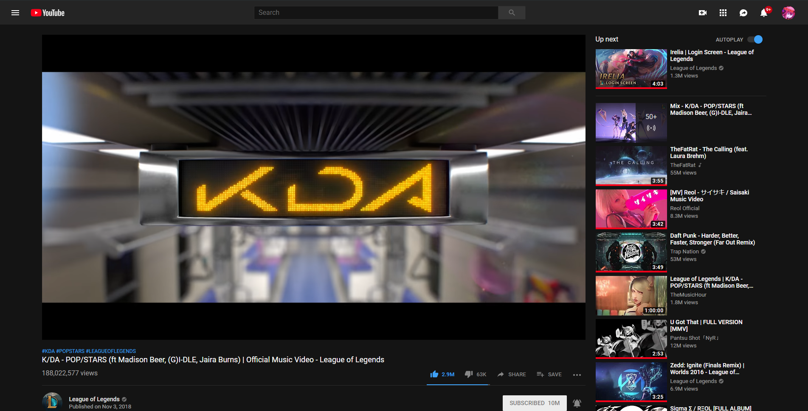
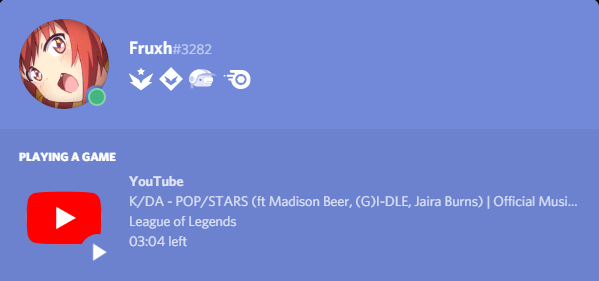

# Imagens de exemplo

#### Exemplos

Isso é o que você ver/escuta no Youtube:

  
E isso é o que acontece no seu perfil quando o PreMiD está rodando e consegue pegar as informações no seu navegador: 

