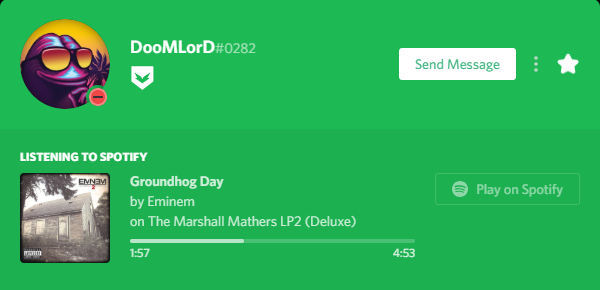

# What's RPC?

#### What is RPC and how does it work?

Rich Presence is one of the coolest features of Discord at this moment and it basically changes the look and style of your "now playing" area on your Discord profile. Discord's RPC supports games \(such as GTA V™, Rainbow Six® Siege etc.\) are broadcasting your in-game status to your Discord profile in a really cool way. You know all that, right? Yes, so they basically create or use their app to send your game status to Discord which renders the information as a Rich Presence on your profile. Finally, they become the way in the picture below.

