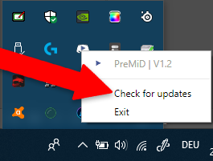
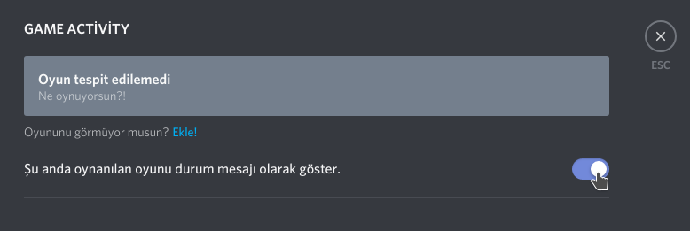
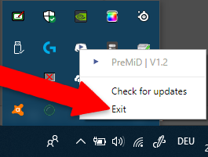

# Hata Giderme


**Her şeyden önce!** PreMiD'in çalışması için [eklentinin](../installation/eklenti.md) ve [uygulamanın](../installation/uygulama.md) yüklü olduğundan emin olun.


### Discord aktiviteyi göstermiyor!?

* Discord'un yönetici olarak çalışmadığından emin olun.
* PreMiD'in son sürümünü kullandığınızdan emin olun. Güncellemeleri kontrol ettirmek için görev çubuğundaki simgeye sağ tıklayarak "Check for Updates" seçeneğini seçin. _Not: Geliştirici ve self-build sürümleri otomatik olarak güncelleme yapamayabilir._

* Discord ayarlarınızdan "Game Activity" altında bulunan resimdeki ayarın açık olduğuna emin olun.

* Sayfayı yenileyin: **Strg+R**/**F5** ya da **CMD+R** kombinasyonlarını kullanarak sayfayı  yenileyin.
* Tarayıcınızı yeniden başlatın! **Alt+F4** bunun için güzel bir kombinasyon \(tabi ki de tarayıcınızı tekrar açmanız gerekli\).
* Eklentilerinizi devre dışı bırakın! PreMiD haricinde eklentilerinizi devre dışı bırakın ve hatanın bundan kaynaklanıp kaynaklanmadığını kontrol edin. Daha sonra teker teker açarak hangi eklentinin hataya sebep olduğunu bulun.
* PreMiD uygulamasını kapatın yeniden başlatın.

* Discord'u yeniden başlatın: **Strg+R** ya da **CMD+R** kombinasyonlarını kullanarak veya manuel olarak yeniden başlatın.
* Bilgisayarınızı yeniden başlatın. Sanırım nasıl başlatıldığını biliyorsunuzdur :^\)
* PreMiD'i yeniden başlatın: Bazen PreMiD, eksik veya hatalı yüklenebilir. Yeniden yüklemek bunu çözebilir. Yükleme adımlarına [buradan](../installation/eklenti.md) ve [buradan](../installation/uygulama.md) ulaşabilirsiniz.
* El ile silme. Eğer başaramazsanız [Discord sunucumuzdan](https://discord.premid.app/) bir yetkiliyi etiketleyebilirsiniz.



1. `C:\Users\USER\AppData\Local` dizinine gidin ve `premid` klasörünü silin.
2. `C:\Users\USER\AppData\Roaming` dizinine gidin ve `PreMiD` klasörünü silin.



`DİSKİNİZ:/users/USER/~Library/Application Support` gidin ve `PreMiD` klasörünü silin.



### Eğer bunlar işe yaramadıysa...

* [Wiki](https://github.com/PreMiD/PreMiD/wiki) sayfasına göz atabilirsiniz.
* [GitHub](https://github.com/PreMiD/PreMiD) üzerinden bir [bildiri](https://github.com/PreMiD/PreMiD/issues/new/choose) açabilirsiniz.
* Discord sunucumuzdaki [\#support](https://discord.premid.app/) kanalından bir yetkiliye danışabilirsiniz.

  

