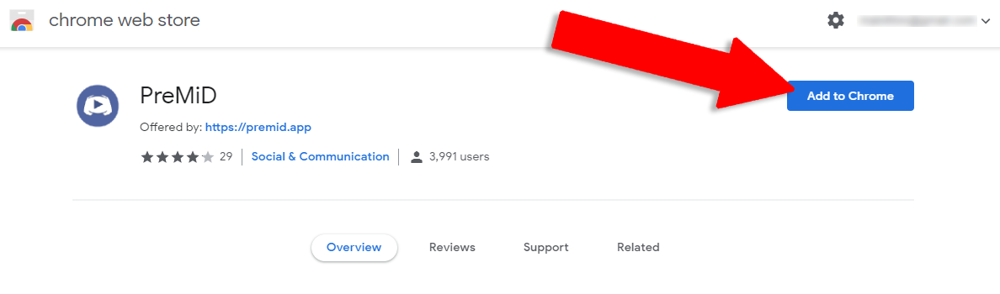

# ส่วนเสริม \(Extension\)


 คุณจำเป็นต้องติดตั้งทั้ง "แอปพลิเคชัน" **และ** "ส่วนเสริม" เพื่อให้การทำงานทำได้ถูกต้อง!


### ส่วนเสริม

ส่วนเสริมนี่เป็นส่วนที่ติดตั้งง่ายที่สุดในโลกเลยล่ะ! ดังนั้นกดกดเลือก "เบราว์เซอร์' ของคุณและอ่านวิธีตามข้างล่างนี้เลย




Firefox ได้ลบส่วนเสริมของเราออกไปจากร้านค้าแล้ว ดังนั้นไม่ต้องกังวลเราจะพยายามชุบชีวิตมันขึ้นมาตามที่เราวางแผนไว้ เพื่ออัปโหลดไว้ที่เว็บไซต์ของเราในเร็ว ๆ นี้ ในตอนนี้คุณจะรอหรือทำตามวิธีตามด้านล่างนี้ได้เลย!


1. ไปที่ [ส่วนของ release](https://github.com/PreMiD/PreMiD/releases)
2. ดาวน์โหลด [premid-1.3.1.2-fx.xpi](https://github.com/PreMiD/PreMiD/releases)
3. ไปที่ `about:addons`
4. กด สัญลักษณ์รูปฟันเฟือง ที่ด้านขวาบน
5. เลือก "**ติดตั้งส่วนเสริมจากไฟล์...**" \(Install add-on from file**\)**
6. เลือกไฟล์ที่ดาวน์โหลดมา
7. ยอมรับการติดตั้งโดยการกด **"เพิ่ม"** \(Add\)
8. ติดตั้งตัว[**แอพลิเคชัน**](application.md)ถ้าหากคุณยังไม่มีมัน



1. ไปที่ [หน้าสโตร์](https://chrome.google.com/webstore/detail/premid/agjnjboanicjcpenljmaaigopkgdnihi?authuser=0&hl=en
   )
2. คลิกที่ **"เพิ่มเข้าใน Chrome" \(Add to Chrome\)**
3. ติดตั้ง[แอปพลิเคชัน](application.md)ถ้าหากคุณยังไม่มี




1. ติดตั้งส่วนเสริมชื่อว่า **"**[**Install Chrome Extensions**](https://addons.opera.com/en/extensions/details/install-chrome-extensions/)**"**
2. ติดตั้ง [ส่วนเสริมของ PreMiD](https://chrome.google.com/webstore/detail/premid/agjnjboanicjcpenljmaaigopkgdnihi)
3. ติดตั้ง [แอปพลิเคชัน](application.md) ถ้าหากคุณยังไม่มี



