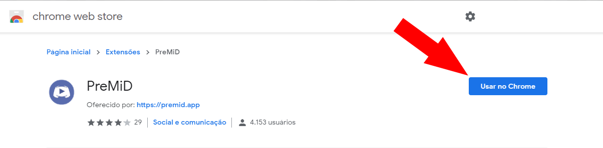

# Extensão


 Você tem que instalar a extensão e o aplicativo para que ele funcione corretamente!


### Extensão

Instalação da extensão é a parte mais fácil! Então, basta clicar no nome do seu navegador e seguir as apresentações.




O Firefox removeu nossa extensão da loja de addons. Não se preocupe, vamos tentar ressuscitá-lo dos mortos, como planejamos fazer o upload para os nossos próprios servidores na próxima atualização! Por enquanto você pode esperar ou seguir as instruções abaixo.


1. Vá para á [aba de releases](https://github.com/PreMiD/PreMiD/releases)
2. Baixe o [premid-1.3.1.2-fx.xpi](https://github.com/PreMiD/PreMiD/releases/download/v1.2.0.1/premid-1.3.1.2-fx.xpi)
3. Vá para `about:addons`
4. Clique no pequeno símbolo de engrenagem no lado superior direito
5. Escolha "Instalar de um arquivo..."
6. Selecione o arquivo que você baixou recentemente
7. Aceite a instalação clicando em "**Adicionar**"
8. Instale o [aplicativo ](application.md)se você ainda não tiver



1. Vá para a [página da loja](https://chrome.google.com/webstore/detail/premid/agjnjboanicjcpenljmaaigopkgdnihi?authuser=0&hl=en)
2. Clique em "**Usar no Chrome**"
3. Instale o [aplicativo](application.md) se você ainda não tiver




1. Instale a extensão chamada "[Install Chrome Extensions](https://addons.opera.com/en/extensions/details/install-chrome-extensions/)"
2. Agora instale a extensão do [PreMiD](https://chrome.google.com/webstore/detail/premid/agjnjboanicjcpenljmaaigopkgdnihi), clicando no **"Usar no Opera"**
3. Instale o [aplicativo](application.md) se você ainda não tiver



