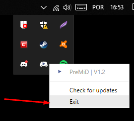

# Troubleshooting

## Primeiro de tudo

Verifique se você tem a [extensão](https://github.com/PreMiD/PreMiD/wiki/Installation#extension) e o [aplicativo](https://github.com/PreMiD/PreMiD/wiki/Installation#application) instalado! Tutoriais para instalação podem ser encontrados[ aqui](https://github.com/PreMiD/PreMiD/wiki/Installation). Você também pode tentar etapas diferentes. Você não precisa experimentá-los na ordem em que os colocamos aqui.

## O Discord não mostra a presença

### Certifique-se de que Discord NÃO esteja sendo executado  como administrador

Muito importante. Discord RPC não funcionará se você executar o Discord como administrador.

**Verifique se você instalou a versão mais recente do PreMiD**

Você pode verificar isso clicando com o botão direito do mouse em **'Check for updates**' no ícone do PreMiD na sua barra de tarefas.  
Caso contrário, o aplicativo informará quando uma nova atualização estiver disponível. E você não precisa se preocupar com a extensão porque ela se atualiza automaticamente.


Versões de desenvolvimento e versões auto-injetadas não serão atualizadas automaticamente


### Certifique-se de ter ativado Discord a Rich Presence nas configurações

### Recarregue a página

Você pode pressionar **Strg+R/F5** ou **CMD+R** no teclado também, em vez de procurar pelo botão de atualização.

### Reinicie seu navegador

**Alt+F4** faz um bom trabalho também. \(Você tem que iniciar o seu navegador novamente, obviamente\)

### Desative seus addons

Desative todos os seus addons e veja se funciona novamente. Se sim, tente habilitar seus addons passo-a-passo e nos informar qual addon quebrou o PreMiD.

### Reinicie o PreMiD \(App\)

Você precisa reiniciar o PreMiD depois disso.

### Recarregar/reiniciar o Discord

Pressione **Strg+R** ou **CMD+R** no seu teclado ou reinicie o Discord manualmente.

### Reiniciando seu computador

Espero que você saiba como reiniciar um computador

### Reinstalando o PreMiD

Às vezes há algo errado com os arquivos ... Tutoriais para instalação podem ser encontrados [aqui](https://github.com/PreMiD/PreMiD/wiki/Installation).

### Remoção manual



1. Vá para `C:\Users\USER\AppData\Local` e exclua a pasta `premid`
2. Vá para `C:\Users\USER\AppData\Roaming` e exclua a pasta`PreMiD`



Vá para `YOURDISK:/users/USER/~Library/Application Support` e exclua a pasta `PreMiD`



Faça um ping em um membro da equipe em nosso [servidor Discord](https://discord.gg/WvfVZ8T) se nenhuma dessas etapas ajudar. 

## Isso não resolveu meu problema

Você também pode:

* Dar uma olhada na [wiki](https://github.com/PreMiD/PreMiD/wiki)
* [Abrir um problema](https://github.com/PreMiD/PreMiD/issues/new/choose) no [GitHub](https://github.com/PreMiD/PreMiD)
* Perguntar a um membro da equipe em [\#support](https://discord.gg/WvfVZ8T)

  

