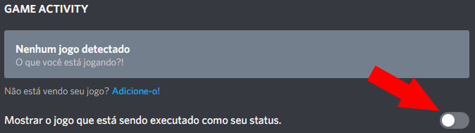

# Solução de problemas

## **Primeiramente**

Tenha a certeza que você tem a [extensão](../installation/extension.md) **e o** [aplicativo](../installation/application.md) instalado!  
Você também pode tentar etapas diferentes. Você não precisa tentar isso na ordem que colocamos.

## Discord não está mostrando a presença

### Tenha certeza que o Discord NÃO está rodando como administrador

Muito importante. Discord RPC não funciona se você roda o Discord como administrador.

### Tenha certeza que você instalou a versão mais recente do PreMiD

Você pode checar isso clicando no botão direito no **'Check for updates'** no ícone do PreMiD na sua taskbar.  
Caso contrário, o app vai te avisar quando uma nova atualização está disponível.  
E você não precisa se preocupar sobre a extensão porque ele se atualiza automaticamente.


Versões de desenvolvimento e versões self-injected não atualizaram automaticamente.


### Tenha certeza que você ativou o Discord Rich Presence nas configurações

### Recarregue a página

Você pode apertar **Strg+R**/**F5** ou **CMD+R** no seu teclado em vez de pesquisar o botão de recarregar.

### Reinicie seu navegador

**Alt+F4** faz um bom trabalho também. \(Você obviamente tem que abrir o navegador de novo\)

### Desative seus addons

Desative todos os seus addons e veja se vai funcionar de novo.  
Se sim, tente ativar seus addons um por um e conte qual addon quebrou o PreMiD.

### Reinicie o PreMiD \(App\)

Você tem que reiniciar o PreMiD.

### Recarregar/reiniciar o Discord

Aperte **Strg+R** ou **CMD+R** no seu teclado ou reinicie o Discord manualmente.

### Reiniciando o computador

Eu espero que você saiba como reiniciar um computador.

### Reinstalando o PreMiD

Algumas vezes tem alguma coisa de errada com os arquivos... Tutoriais de instalação podem ser achados [aqui](../installation/application.md).

### Remoção manual



1. Vá para o `C:\Users\USER\AppData\Local` e delete a pasta `premid`
2. Vá para o `C:\Users\USER\AppData\Roaming` e delete a pasta `PreMiD`



Vá para `YOURDISK:/users/USER/~Library/Application Support` e delete a pasta `PreMiD`



Cite um membro da staff no nosso [servidor do Discord](https://discord.gg/WvfVZ8T) se nenhuma dessas etapas ajudaram.

## Isso não resolveu meu problema

Você pode tentar:

* [Abrir uma issue](https://github.com/PreMiD/PreMiD/issues/new/choose) no [GitHub](https://github.com/PreMiD/PreMiD) \(em inglês\)
* Fale com um membro da Staff no [\#support](https://discord.gg/WvfVZ8T) \(em inglês\)

  

